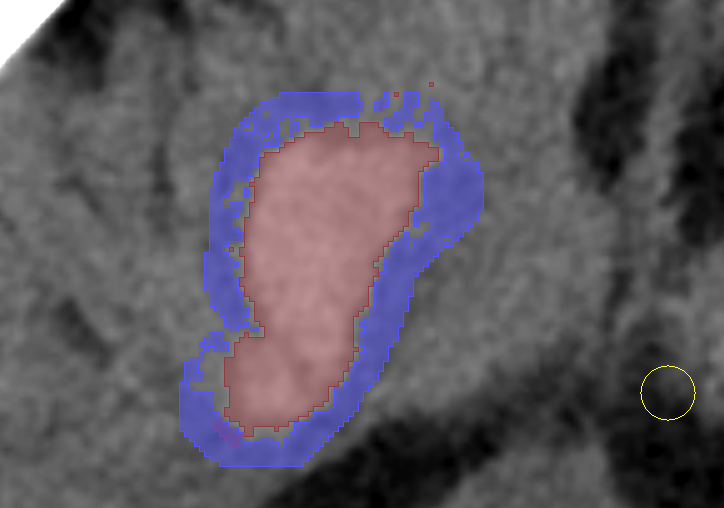

# SlicerHemorrhageTools

A small scripted 3D Slicer module for faster manual cleanup of hemorrhage
segmentations.

The first version focuses on one-click Segment Editor setup for common
HU-constrained Paint and Erase workflows:

- Set CT brain window to W/L 80/40
- Editable HU ranges with defaults of 40-80 and 5-33
- Paint or erase with either HU range
- Increase or decrease brush size
- Toggle editable intensity masking
- Show current tool, HU mask, and brush status
- Set Segment Editor overwrite mode to avoid overwriting other segments
- Open Segment Editor from the module panel when setup is needed



## Target

This module is intended for 3D Slicer 5.10.

## Install

1. Open 3D Slicer.
2. Go to **Edit > Application Settings > Modules**.
3. Add this folder as an additional module path:

   ```text
   <path-to-this-repo>/SlicerHemorrhageTools
   ```

   For example, if the repo is in your Documents folder on macOS:

   ```text
   ~/Documents/Slicerhemorrhagetools/SlicerHemorrhageTools
   ```

   On Windows, it may look like:

   ```text
   C:\Users\<YourName>\Documents\Slicerhemorrhagetools\SlicerHemorrhageTools
   ```

4. Restart Slicer.
5. Open **Modules > Segmentation > Hemorrhage Tools**.

## Use

1. Load the CT volume and segmentation.
2. Open Hemorrhage Tools.
3. Click **Open Segment Editor** if you need to choose the source volume,
   segmentation, or active segment.
4. Return to Hemorrhage Tools.
5. Adjust either HU range if needed.
6. Click the desired workflow button.

The module uses the current Segment Editor context. It does not create a new
segmentation or force re-selection of volumes. If Segment Editor does not
already have a source volume selected, the module uses the current background
volume from the slice viewers.

## Tested Workflow

This workflow was tested in 3D Slicer:

1. Load a CT scan.
2. Click **Set Brain Window**.
3. Click **Open Segment Editor**.
4. Add a segment and rename it `Hemorrhage`.
5. Switch back to Hemorrhage Tools from the module history.
6. Paint the hemorrhage using the HU-constrained Paint button.
7. Switch back to Segment Editor and add an `Edema` segment.
8. Switch back to Hemorrhage Tools and paint edema.
9. Use the Erase buttons for quick cleanup when painting extends outside the target region.

## Notes

- Brain window currently uses window 80 and level 40.
- Brush size changes by 1 mm per click, with a minimum diameter of 0.5 mm.
- The Paint/Erase buttons use the HU values currently shown in the range fields.
- Applying a Paint/Erase mode sets Segment Editor overwrite mode to
  **do not overwrite segments**.
- Editable intensity masking limits painting/erasing by source CT HU, but it
  does not make segments mutually exclusive. If two visible segments overlap,
  Slicer may show blended overlay colors. Use the Erase buttons to remove
  spillover from the active segment, and confirm the correct active segment in
  Segment Editor before painting.
- Keyboard shortcuts are intentionally left out of the first version so the
  interface stays clear for handoff to students.
